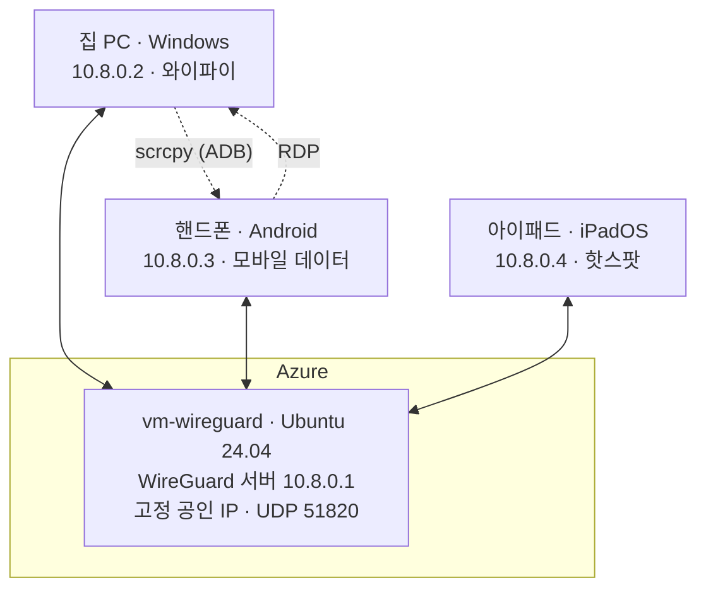

# WireGuard: Azure VM 기반 VPN 구축과 이종 기기 원격 제어

Azure VM을 중계 서버로 **WireGuard VPN**을 구축하고, 서로 다른 네트워크에 있는 PC · Android · iPad를
하나의 가상 사설망(`10.8.0.0/24`)으로 묶어 **연결성과 원격 제어를 검증한 홈랩 기록**입니다.

## 구성도

서버를 허브로 두는 구조입니다. 클라이언트의 `AllowedIPs = 10.8.0.0/24`와 서버의 IP 포워딩으로
클라이언트끼리도 서버를 거쳐 통신합니다.

| 항목 | 값 |
|---|---|
| 서버 | Azure VM, Ubuntu Server 24.04 LTS |
| 공인 IP | Standard SKU, 정적 할당 |
| 포트 | UDP 51820 (NSG 인바운드 허용) |
| 가상 대역 | 10.8.0.0/24 |
| 서버 구동 | `systemctl enable --now wg-quick@wg0` |
| PC 구동 | 터널을 Windows 서비스로 등록 (`/installtunnelservice`) |
| 모바일 등록 | 서버에서 `qrencode`로 QR코드 생성 후 앱에서 스캔 |

## 검증 결과

| 단계 | 내용 | 결과 |
|---|---|:---:|
| 1~3 | Azure VM 생성, NSG 설정, WireGuard 서버 설치·구동 | ✅ |
| 4 | Windows PC 클라이언트 연결 (handshake, ping) | ✅ |
| 5 | Android 클라이언트 연결 (handshake, ping) | ✅ |
| Phase 7 | 핸드폰 → PC 원격 제어 (RDP), 화면·오디오 전달 | ✅ |
| Phase 8 | PC → 핸드폰 화면 제어 (scrcpy, 무선 ADB) | ✅ |
| Phase 9 | iPadOS 클라이언트 추가 | ✅ |
| Phase 10 | 다른 건물 네트워크에서 접속: 핸드폰 | ✅ |
| Phase 10 | 다른 건물 네트워크에서 접속: 노트북 | ⚠️ 실패 (원인 미해결) |

검증한 범위는 OS 3종(Windows, Android, iPadOS), 네트워크 3종(집 와이파이, 이동통신망, 다른 건물망)입니다.

## 트러블슈팅 하이라이트

전체 기록은 [진행상황 정리](WireGuard_진행상황_정리.md)에 있습니다.

| 증상 | 원인 | 해결 |
|---|---|---|
| handshake가 계속 재시도됨 | 서버 `wg0.conf`를 재생성해 서버 공개키가 바뀌었는데 클라이언트는 예전 키를 참조 | 클라이언트 `[Peer] PublicKey` 갱신 |
| RDP `Connection refused` | TermService 중지 + 레지스트리 `fDenyTSConnections=1` | 서비스 시작, 값 0으로 변경, 방화벽 규칙 활성화 |
| PC→폰 ping은 되는데 폰→PC는 안 됨 | `wg0-pc` 어댑터가 Public 프로필이라 Windows 방화벽이 인바운드 ICMP 차단 | 어댑터를 Private로 전환(`Set-NetConnectionProfile`), ICMP 규칙 활성화 |
| `wg set`으로 피어를 추가해도 `wg show`에 안 뜸 | 피어 공개키 자리에 서버 자신의 공개키를 넣음 (에러 없이 무시됨) | 올바른 클라이언트 공개키로 재등록 |
| `wg genkey \| tee A \| wg pubkey \| tee B` 후 A가 0바이트 | 파이프 중간 명령이 먼저 끝나 broken pipe 발생 | 리다이렉션으로 명령 분리 |
| 자고 일어나니 RDP 끊김 | PC의 WireGuard 터널 서비스가 Stopped | 터널 재활성화 |

## 문서

| 문서 | 내용 |
|---|---|
| [연결테스트 계획서](WireGuard_연결테스트_계획서.md) | 테스트 목표, 단계별 절차, 검증 체크리스트, 캡처 포인트 |
| [진행상황 정리](WireGuard_진행상황_정리.md) | 개념 정리(키, Peer, AllowedIPs, NSG), 단계별 결과, 트러블슈팅 전체 기록 |
| [설정 파일 (공개용)](WireGuard_설정_공개용.md) | 서버·PC·핸드폰·아이패드 conf 예시 (민감 정보 마스킹) |

## 남은 과제

- 노트북에서 UDP 패킷이 나가지 않는 원인 규명 (Wireshark로 `udp.port == 51820` 캡처)
- PC → 아이패드 화면 미러링
- 캡처·녹화 영상 정리

## 보안 유의사항

- 개인키와 실제 값이 들어간 `.conf`, `.key` 파일은 저장소에 올리지 않습니다.
- 사용하지 않을 때는 VM을 할당 취소(Deallocate)해 비용을 막습니다. 정적 공인 IP는 유지됩니다.
